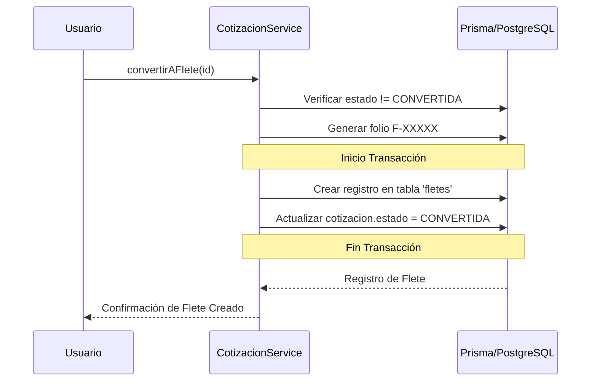
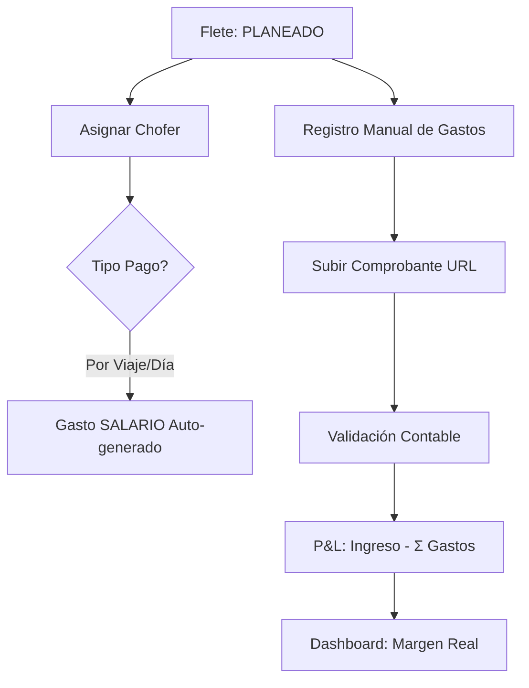

# 🚛 LogiProfit

**Plataforma SaaS de Rentabilidad Inteligente para Empresas de Fletes**

LogiProfit permite a las empresas de transporte conocer la rentabilidad real de cada viaje, tratando cada flete como un mini estado de resultados (P&L).

---

## ✅ Estado Actual del Sistema
**Sistema 100% Funcional y Listo para Producción**
- **Backend**: NestJS + Prisma (PostgreSQL)
- **Frontend**: React 18 + TypeScript + Tailwind CSS
- **Despliegue**: Preparado para Railway + Supabase

---

## 🎯 Características Principales
- **Cotizaciones Inteligentes**: Simula costos antes de aceptar un flete.
- **Gestión de Fletes**: Control completo del ciclo de vida (Planeado → En Curso → Cerrado).
- **Módulo de Mantenimiento**: Alertas preventivas y control de reparaciones por camión.
- **Categorías y Presupuestos**: 14 categorías de gastos con control presupuestal.
- **Notificaciones Real-Time**: WebSocket para alertas urgentes y márgenes bajos.
- **Exportación**: Generación de reportes profesionales en PDF y Excel (multi-sheet).
- **Sistema RBAC**: Control de acceso basado en 25 permisos granulares.

---

## ⚙️ Flujos Técnicos

### 1. Conversión de Cotización a Flete (Transaccional)
Cuando una cotización es aprobada, el sistema utiliza una transacción de base de datos para asegurar la integridad:


**Detalle Técnico**: Los precios se copian de la cotización al flete para mantener un registro histórico inmutable, incluso si la cotización original se modificara después.

### 2. Gestión de Gastos y P&L Real
El sistema recalcula la utilidad cada vez que se interactúa con un gasto.


**Lógica de Negocio**:
- **Validación**: Un flete en estado `CERRADO` no puede tener gastos sin validar.
- **Salarios**: Si el chofer tiene esquema de pago por viaje o km, la asignación al flete dispara la creación automática de un gasto tipo `SALARIO`.

### 3. Motor de Pendientes (Dashboard)
El dashboard utiliza lógica de agregación y filtros complejos para identificar tareas críticas:

| Pendiente | Lógica Técnica de Detección (SQL/Prisma) |
|-----------|------------------------------------------|
| **Fletes sin Gastos** | `flete.estado IN [EN_CURSO, COMPLETADO] AND flete.gastos.none()` |
| **Cotizaciones Vencidas** | `cot.estado IN [ENVIADA, BORRADOR] AND cot.validoHasta <= hoy + 7d` |
| **Comprobantes Faltantes** | `gasto.comprobanteUrl == null` |
| **Pagos Vencidos** | `flete.estadoPago IN [PENDIENTE, PARCIAL] AND flete.fechaVencimiento < hoy` |

### 4. Sistema de Alertas Proactivas
Utiliza WebSockets (Socket.io) para notificar sin necesidad de recargar la página.
- **Gateway**: `NotificationsGateway` maneja salas por `empresaId`.
- **Eventos**: `flete-urgente`, `flete-perdida`, `cotizacion-aprobada`, `margen-bajo`.
- **Trigger**: Los hooks de Prisma (o servicios) emiten eventos al detectar umbrales de margen < 15%.

---

## 🚀 Inicio Rápido (Desarrollo)

### Prerrequisitos
- Node.js 18+, PostgreSQL 14+, npm

### Instalación
```bash
# 1. Clonar e instalar backend
cd backend && npm install
cp .env.example .env # Configura DATABASE_URL, JWT_SECRET, FRONTEND_URL
npx prisma generate
npx prisma migrate dev
npm run start:dev

# 2. Instalar frontend (en otra terminal)
cd frontend && npm install
npm run dev
```

---

## ☁️ Despliegue en Railway

### 1. Backend (NestJS)
- **Root Directory**: `backend`
- **Build Command**: `npx prisma generate && npm run build`
- **Start Command**: `npm run start:prod`
- **Variables**: `DATABASE_URL` (Supabase), `JWT_SECRET`, `FRONTEND_URL`.

### 2. Frontend (Vite)
- **Root Directory**: `frontend`
- **Variables**: 
  - `VITE_API_URL`: URL del backend + `/api/v1`
  - `VITE_WS_URL`: URL del backend

---

## 📋 Guía del Dashboard de Pendientes
Accede desde el menú lateral (ícono ⏰) para gestionar:
1.  🟡 **Fletes sin Gastos**: Viajes activos sin registros financieros.
2.  🟠 **Cotizaciones por Vencer**: Seguimiento a propuestas próximas a expirar.
3.  🔴 **Comprobantes Faltantes**: Gastos registrados sin factura (XML/PDF).
4.  🟣 **Pagos Vencidos**: Control de cobranza.

---

## 🔐 Roles y Permisos
- **Admin**: Control total.
- **Operador**: Cotizaciones y fletes.
- **Chofer**: Registro de gastos.
- **Contabilidad**: Validación de facturas y presupuestos.

---

## 📝 Notas de Desarrollo
- **Prisma Decimals**: Siempre convertir a número en el frontend: `Number(valor) || 0`.
- **Caché**: Si hay cambios visuales no reflejados, usa `Ctrl + Shift + R`.
- **RBAC**: Usa el hook `usePermissions()` para proteger componentes en el frontend.

---
**Generado:** Diciembre 2024
**Licencia:** MIT
